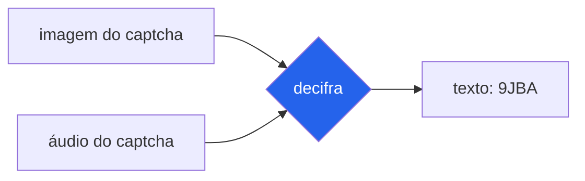
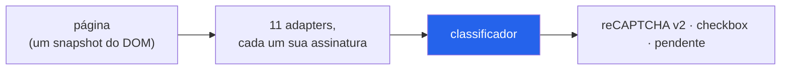
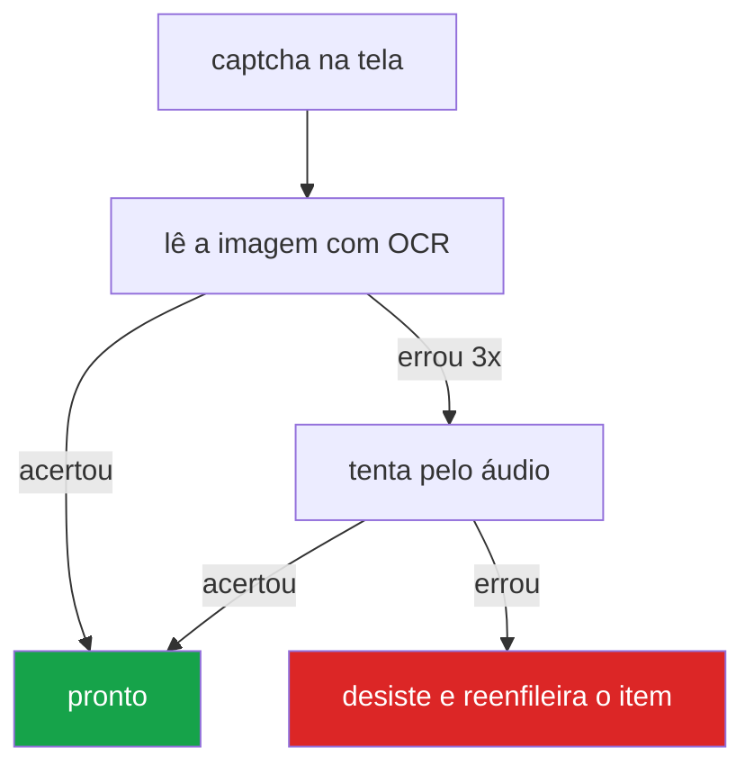
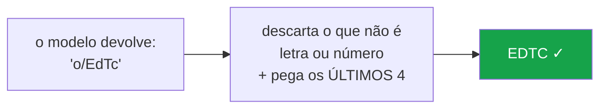
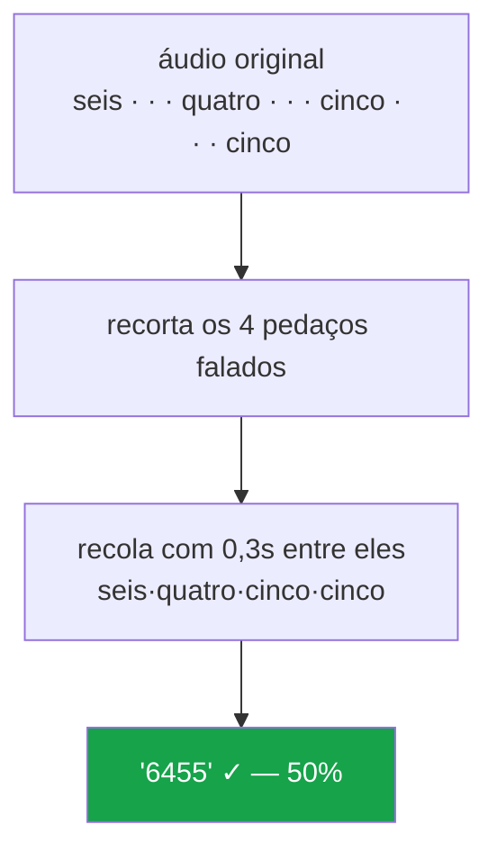

# decifra

**Identifica e lê captchas.** Diz qual captcha uma página usa (11 tipos), e
resolve os que se resolvem *lendo* — captcha de texto em imagem e o canal de
áudio de acessibilidade. Roda na sua máquina, sem serviço pago. Feito para entrar
em **automação de processos (RPA)**: a automação chega numa página, pergunta o
que tem ali, e para um captcha de imagem ou áudio recebe o texto pronto para
digitar.

```python
from leitor import imagem

texto = imagem.ler(png_bytes, tamanho=4)   # -> "9JBA"
```

Duas coisas que ele faz, ditas com precisão:

- **Passa** por captcha de **imagem** e de **áudio** — porque, nesses, ler o
  texto e digitá-lo *é* passar pelo captcha. É o mesmo que um humano faz.
- **Detecta** (mas não resolve) captchas de **desafio-resposta** — reCAPTCHA,
  hCaptcha, AWS WAF, GeeTest, Arkose, Friendly, ALTCHA. Esses emitem um token
  preso à sessão do navegador: não há texto para ler, e o token não se gera de
  fora. Saber que estão lá já ajuda a automação a decidir o que fazer.

> Também é um **estudo de engenharia**. O que ele mostra de verdade não é
> "resolver captcha" — é o que se aprende medindo com cuidado: um OCR que salta
> de 16% para 64% com três linhas de pós-processamento, um reconhecedor de fala
> que sai de 4% para 50% quando você ajusta *o espaçamento* do áudio, e uma
> coleção de bugs que só apareceram porque a medição foi honesta. A história está
> em [docs/COMO_FUNCIONA.md](docs/COMO_FUNCIONA.md).

---

## Índice

- [O que é, em uma imagem](#o-que-é-em-uma-imagem)
- [Rodando em 5 minutos](#rodando-em-5-minutos)
- [Identificar qual captcha é](#identificar-qual-captcha-é)
- [As duas vias de leitura](#as-duas-vias-de-leitura)
- [O truque da imagem: "últimos N"](#o-truque-da-imagem-últimos-n)
- [O truque do áudio: reespaçar a fala](#o-truque-do-áudio-reespaçar-a-fala)
- [A API](#a-api)
- [O que este projeto NÃO faz](#o-que-este-projeto-não-faz)
- [Números medidos](#números-medidos)
- [Onde é legítimo usar isto](#onde-é-legítimo-usar-isto)

---

## O que é, em uma imagem

Um captcha simples pede que você leia caracteres distorcidos e os digite. Quem é
cego não consegue — por isso a maioria oferece um **botão de áudio** que narra os
mesmos caracteres. `decifra` sabe ler os dois canais.



Nada aqui contorna a proteção de um site. O trabalho é o mesmo que um humano faz
ao olhar a imagem ou ouvir a narração: transformar o que vê ou ouve em texto.

---

## Rodando em 5 minutos

```bash
git clone https://github.com/GustavoInacio-Dev/decifra.git
cd decifra
pip install -r requirements.txt
```

Ler uma imagem que você tem em disco:

```bash
python exemplos/uso_basico.py caminho/para/captcha.png
# lido: 9JBA
```

Ler pelo áudio, informando quantos caracteres o captcha tem:

```bash
python exemplos/uso_basico.py caminho/para/audio.wav --audio --tamanho 6
```

A primeira leitura de imagem baixa o modelo de OCR (1,34 GB, uma vez só) e leva
uns 20 segundos. Depois disso, cada leitura leva ~1,4 s.

---

## Identificar qual captcha é

Antes de tentar resolver, uma automação precisa saber **com o que está lidando**.
A camada de detecção olha a página e responde: reCAPTCHA (v2/v3/Enterprise),
hCaptcha, AWS WAF, GeeTest (v3/v4), Arkose, Friendly, ALTCHA, ou captcha de
imagem caseiro. É só leitura de DOM — não clica em nada.



```python
from deteccao.adapters import ADAPTERS, Ctx
from deteccao.core.classifier import classificar

brutos = [a.detect(Ctx(retrato=retrato)) for a in ADAPTERS]   # retrato = snapshot do DOM
for d in classificar([b for b in brutos if b.presente], Ctx(retrato=retrato)):
    print(d.vendor.value, d.variant.value, d.state.value)
```

Isso importa para uma RPA porque **detectar não é resolver**: para um captcha de
imagem, ela segue para o leitor; para um reCAPTCHA, ela sabe que não há o que ler
e decide (pular, reenfileirar, avisar) em vez de travar. O desenho — padrão
adapter, detecção multi-sinal, classificador — está em
[docs/ARQUITETURA.md](docs/ARQUITETURA.md). Um exemplo rodável sem navegador está
em [exemplos/uso_deteccao.py](exemplos/uso_deteccao.py).

---

## As duas vias de leitura

A imagem é a via principal: rápida, local, e acerta bem. O áudio é a reserva —
entra quando a imagem falha, e vale porque **as duas erram em casos diferentes**.



Medido em 50 amostras: sozinha, a imagem acerta 68%. Somando o áudio nos casos
que a imagem erra, a cobertura sobe para 86%. O áudio é caro (precisa de rede) e
mais lento, então ele só entra na última tentativa — em cerca de 5% dos itens.

---

## O truque da imagem: "últimos N"

O modelo de OCR, sozinho, acerta só **16%**. Ele lê a sujeira do fundo da imagem
como se fosse letra e devolve lixo grudado na resposta, quase sempre no começo:



Só isso — jogar fora os caracteres estranhos e pegar os últimos N — leva a taxa
de **16% para 64%**. Pegar os *primeiros* N, em vez dos últimos, dá 30%: o lixo
mora mais no início, porque a leitura começa pela margem esquerda da imagem.

O número de caracteres é **parâmetro**, não fixo. O padrão é 4, mas você passa
`tamanho=6` para um captcha de 6, e é esse número que decide onde cortar.

---

## O truque do áudio: reespaçar a fala

Este é o achado mais interessante do projeto. A narração dita os caracteres com
um silêncio longo entre cada um. O reconhecedor de fala, ao ouvir o primeiro
silêncio, **acha que a frase acabou** e para de ouvir — devolvia "seis" para um
captcha "6455". Com o áudio original, a taxa era de 4%.

A correção não é trocar de reconhecedor. É recortar os pedaços falados e
**recolá-los com um intervalo curto e uniforme**, para que o reconhecedor não
interprete o silêncio como fim:



O tamanho desse intervalo importa, e foi medido variando **só ele**:

| intervalo | acerto |
|----------:|:------:|
| 0,05s | 30% |
| 0,15s | 35% |
| **0,30s** | **50%** |
| 0,40s | 25% |
| 0,55s | 10% |
| 0,70s | 0% |

Curto demais funde letras vizinhas; longo demais traz de volta o problema do
silêncio. O pico é nítido em 0,30s. Toda essa medição e o porquê estão em
[docs/COMO_FUNCIONA.md](docs/COMO_FUNCIONA.md).

---

## A API

Para uma máquina que não quer carregar 1,34 GB de modelo, há uma API HTTP: você
sobe uma instância, e vários programas mandam os bytes e recebem o texto.

```bash
python exemplos/servidor.py
```

```python
import requests

r = requests.post("http://localhost:8010/ler/imagem",
                  json={"imagem_b64": "iVBORw0KGgo...", "tamanho": 4}).json()
print(r["texto"])            # "9JBA"
```

Rotas: `/ler/imagem`, `/ler/audio`, `/ler` (as duas vias numa chamada, com sinal
de concordância) e `/saude`. Há um cliente pronto de um arquivo em
[api/cliente.py](api/cliente.py) que traduz a resposta em decisão — inclusive a
diferença entre "não leu, tente de novo" e "não adianta insistir". O contrato
completo está em [api/README.md](api/README.md).

---

## O que este projeto NÃO faz

Isto é o limite do escopo, e é deliberado:

- **Não resolve Cloudflare, reCAPTCHA, hCaptcha** ou qualquer desafio-resposta de
  fornecedor. Ele os **detecta** (útil para a automação saber o que tem na
  página), mas resolvê-los está fora do escopo: emitem um token amarrado à sessão
  do navegador — não há o que "ler", e gerar o token do lado de fora não funciona.
- **Não simula ser humano.** Não move mouse em curva, não resolve quebra-cabeça
  de arrastar peça, não tenta enganar detecção de bot.
- **Não promete acertar sempre.** É um leitor com taxa de erro medida (~64% por
  leitura de imagem). Errar é esperado; a estratégia é tentar de novo.

Se você precisa de "sempre acerta" ou de contornar uma proteção, este não é o
projeto — e, honestamente, a resposta certa costuma ser procurar uma **API
oficial** do serviço que você consulta.

---

## Números medidos

Todos vêm de banco rotulado ou de execução real, e estão detalhados em
[docs/MEDICOES.md](docs/MEDICOES.md). Um número sem procedência não entra.

| Via | Acerto | Observação |
|-----|:------:|-----------|
| Imagem (OCR), por leitura | 64% | cru: 16% |
| Imagem, em 4 tentativas | ~98% | errar recarrega o captcha |
| Áudio (Wit, reespaçado) | 50% | cru: 4% |
| Áudio (Google SR) | 42% | motor de reserva |
| Imagem **+** áudio | 86% | as duas vias combinadas |

> As taxas foram medidas num tipo específico de captcha (4 caracteres, fonte
> serifada, sem distorção geométrica). Em outro captcha o número muda — pode ser
> melhor ou pior, e **só se sabe medindo**. Não trate estes valores como garantia
> para o seu caso.

---

## Onde é legítimo usar isto

Ler um captcha é honesto ou não dependendo do caso, não da ferramenta. Bons usos:

- **O canal de áudio de acessibilidade** — é literalmente o recurso que o site
  oferece a quem não enxerga.
- **O seu próprio site**, para testá-lo de ponta a ponta.
- **Dados públicos**, quando o serviço permite consulta programática e você
  respeita o volume e os termos dele.

E antes de automatizar qualquer consulta: **veja se existe uma API oficial**.
Quase sempre é mais rápida, mais estável, e dispensa o captcha por completo.

---

## Estrutura

```
deteccao/     core/ (detector, classifier, base, models, ...)  ·  adapters/ (11 fornecedores)
leitor/       imagem.py (OCR)  ·  _cascata.py (áudio)  ·  _motores.py (transcrição)
api/          app.py (FastAPI)  ·  cliente.py (cliente de 1 arquivo)  ·  test_api.py
testes/       testes sintéticos, sem rede e sem modelo
exemplos/     servidor.py  ·  uso_basico.py  ·  uso_deteccao.py
docs/         COMO_FUNCIONA.md (o writeup)  ·  ARQUITETURA.md  ·  MEDICOES.md
scripts/      varredura.py (trava de publicação)
```

## Rodando os testes

```bash
python -m unittest testes.test_leitor testes.test_deteccao -v   # leitor + detecção
python -m unittest api.test_api -v                              # API
python leitor/imagem.py                                          # selfcheck de um módulo só
```

## Licença

MIT — ver [LICENSE](LICENSE).
