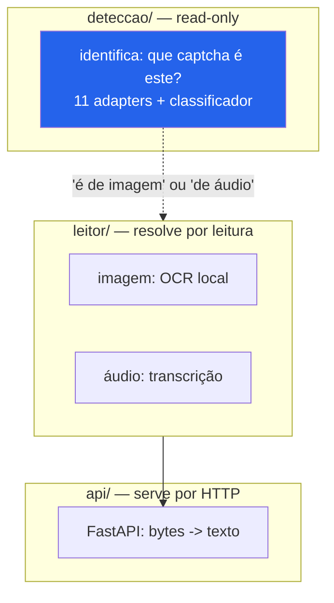
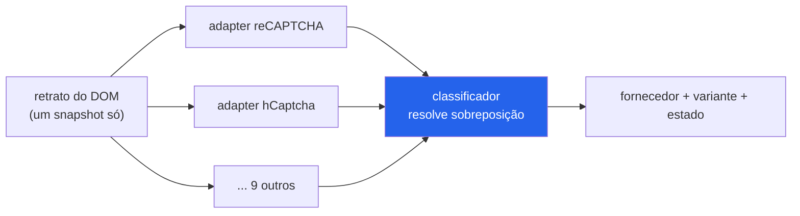

# Arquitetura

O projeto tem três camadas independentes. Você usa a que precisar; nenhuma
obriga a outra.

## `deteccao/` — identificar (read-only)

Dada uma página, dizer **qual** captcha ela usa: reCAPTCHA (v2/v3/Enterprise),
hCaptcha, AWS WAF, GeeTest (v3/v4), Arkose, Friendly Captcha, ALTCHA, ou um
captcha de imagem caseiro. É só leitura de DOM — não clica, não resolve, não
gera token.

O desenho é um **padrão adapter com detecção multi-sinal**:

Cada adapter declara uma **assinatura** (scripts, seletores, globais, campos) e
responde `presente?` / `variante` / `estado` a partir do retrato. Um único
snapshot alimenta todos — não há N varreduras do DOM. O classificador resolve
quando dois adapters reivindicam a mesma área (reCAPTCHA Enterprise vs v2, por
exemplo, que compartilham container).

Duas regras de projeto que valem citar, porque vieram de erro medido (ver
[COMO_FUNCIONA.md](COMO_FUNCIONA.md)):

- **Ausência de iframe nunca conclui ausência de captcha.** Só se conclui
  "presente" com evidência positiva; a falta de um sinal não é prova do
  contrário.
- **Cada `detect()` é isolado.** Um adapter que levanta exceção não derruba a
  detecção — os outros seguem.

## `leitor/` — resolver por leitura

Para os captchas cuja resposta **está na imagem ou no áudio** — captcha de texto
distorcido e o canal de áudio de acessibilidade —, ler é resolver. Esta camada
faz isso: OCR local para imagem, transcrição para áudio. É o coração do projeto,
detalhado no [README](../README.md) e no [COMO_FUNCIONA.md](COMO_FUNCIONA.md).

## `api/` — servir por HTTP

Uma casca FastAPI fina sobre o `leitor/`, para uma máquina não precisar carregar
o modelo. Contrato em [api/README.md](../api/README.md).

## O que fica de fora, e por quê

Captchas de **desafio-resposta** (reCAPTCHA, hCaptcha, Cloudflare e afins)
emitem um token amarrado à sessão do navegador. Não há texto para "ler" e o token
não pode ser gerado de fora. A camada de detecção **reconhece** esses tipos — é
útil saber que estão lá —, mas resolvê-los está fora do escopo, de propósito.
